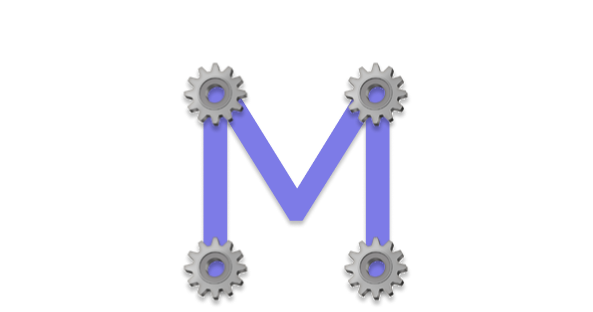

<h1> Memorizer </h1>
A Nextjs app with Redis Database for superfast searching and instant notetaking.
   
   
  

## Demo link:

Access my site at [link](https://nextapp-with-redis-92y2ei57l-ashishpawar517.vercel.app/)

## Table of Content:

- [About The App](#about-the-app)
- [Screenshots](#screenshots)
- [Technologies](#technologies)
- [Setup](#setup)
- [Approach](#approach)
- [Status](#status)
- [Credits](#credits)
- [License](#license)

## About The App

I wanted to have an app to store new things I have found on the interent and note it down somewhere and then later on just search it efficiently. So, I have built an for the same usecase. I have built an nextapp built on top of Redis which gives the superfast search ability.

<!-- ## Screenshots

 -->

## Technologies

I used `nextjs` , `react-boostrap` and `react-bootstrap-icons`.

## Setup And Usage

- download or clone the repository
- run `npm install`
- run `npm run dev`

## Status

Project is completed with all the features. You can request for new features. or Fork and create PR for the same. `

## Credits

List of contriubutors:

- [Ashish Pawar](https://github.com/ashishpawar517)

<!-- ## License

MIT license @ [Ashish Pawar]()
 -->
